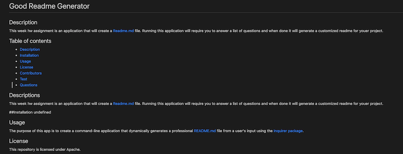

  
  # Good Readme Generator

  ## Description

  This week hw assignment is an application that will create a Readme.md file. Running this application will require you to answer a list of questions and when done it will generate a customized readme for youer project.

  ## Table of contents

  * [Description](#description)
  * [Installation](#installation)
  * [Usage](#usage)
  * [License](#license)
  * [Contributors](#contributors)
  * [Test](#test)
  * [Questions](#questions)

  ## Descriptions

  This week hw assignment is an application that will create a Readme.md file. Running this application will require you to answer a list of questions and when done it will generate a customized readme for youer project.

  ## Installation
  
  Inquirer

  ## Usage

  The purpose of this app is to create a command-line application that dynamically generates a professional README.md file from a user's input using the Inquirer package.

  ## License 

  This repository is licensed under Apache.

  
  ## Test 
  
  npm i inquirer
  
  ## Questions
  
  If you have any questions, contact me at carlos.abril87@outlook.com or at my (https://github.com/cabril87).

  

  
